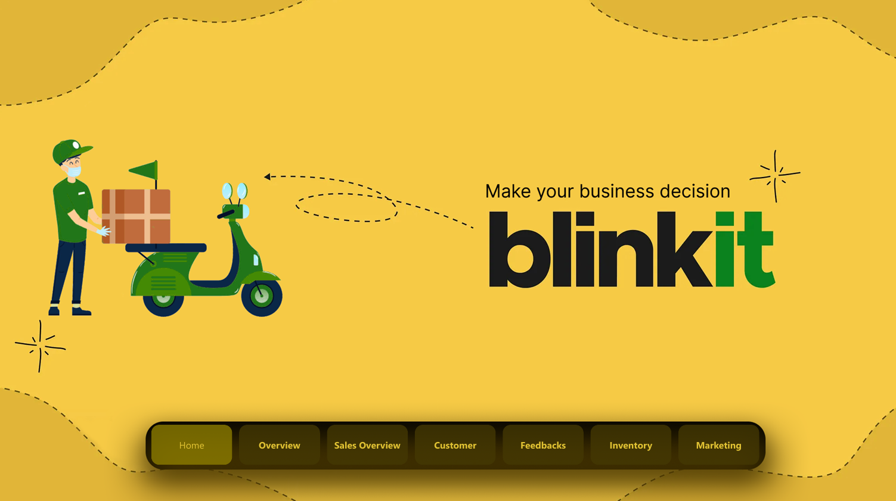
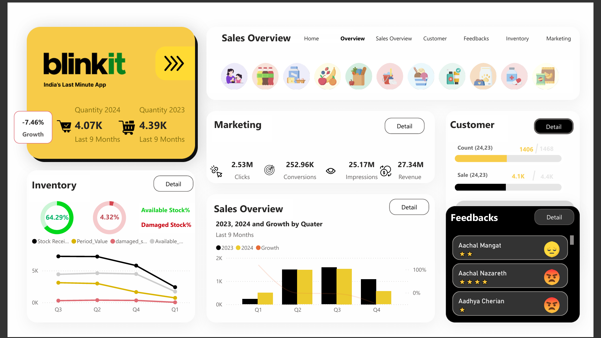
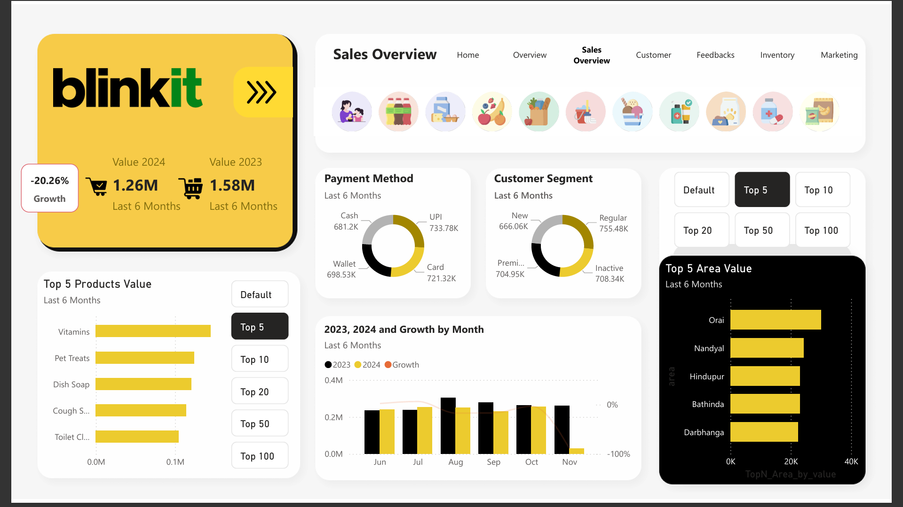
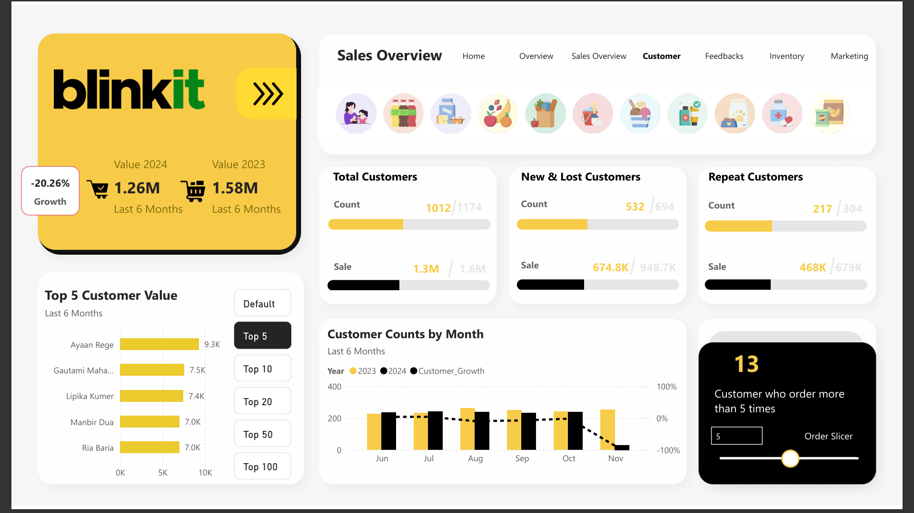
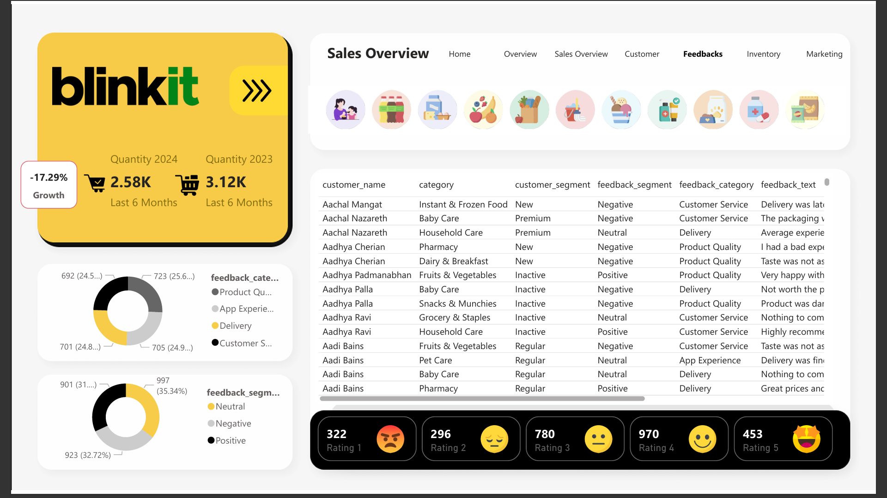
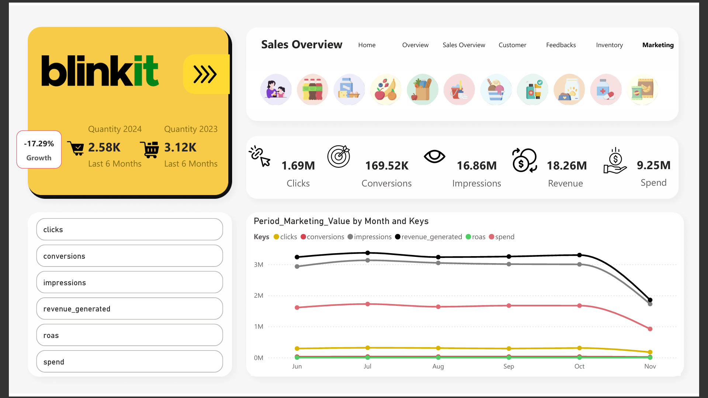

# Blinkit Dashboard Analysis 📊

This project is a comprehensive data dashboard built to analyze Blinkit’s business performance across key areas: sales, customer feedback, inventory, and marketing.

### 🔍 Overview
The dashboard visualizes:
- 📉 Sales trends and growth comparison (2023 vs 2024)
- 💬 Customer sentiment analysis based on ratings and feedback
- 📦 Inventory status, stock movement, and damage rate
- 🎯 Marketing insights (clicks, conversions, ROAS, revenue)

### 📁 Files
- `Blinkit_Dashboard.pdf`: Full interactive report exported from Power BI
- `walkthrough_video.mp4`: (Optional) Screen recording of the dashboard walkthrough
- `images/dashboard_preview.png`: Preview snapshot for README and sharing

### 💡 Insights
- Sales quantity dropped by **7.46%**
- Common complaints in feedback: **delivery delays, product quality**
- **64.29%** stock availability, **4.32%** damaged
- Marketing generated over **₹18M** in revenue

### 🛠️ Tools Used
- Power BI
- Excel (data preprocessing)
- Canva / Figma (if used for visuals)
- [Optional: Python / Pandas for data prep]

---

## 📸 Full Dashboard Preview

Here’s a complete visual walkthrough of the dashboard:

### 📊 Page 1

### 📊 Page 2

### 📊 Page 3

### 📊 Page 4

### 📊 Page 5

### 📊 Page 6

### 📊 Page 7

### 📊 Power BI File
- Blinkit_Dashboard.pbix`: You can open this file in Power BI Desktop to explore the report structure, visuals, and data model.

### 📬 Contact
Feel free to connect with me on [LinkedIn](https://linkedin.com/in/rahulmudgil) for feedback or collaboration!

